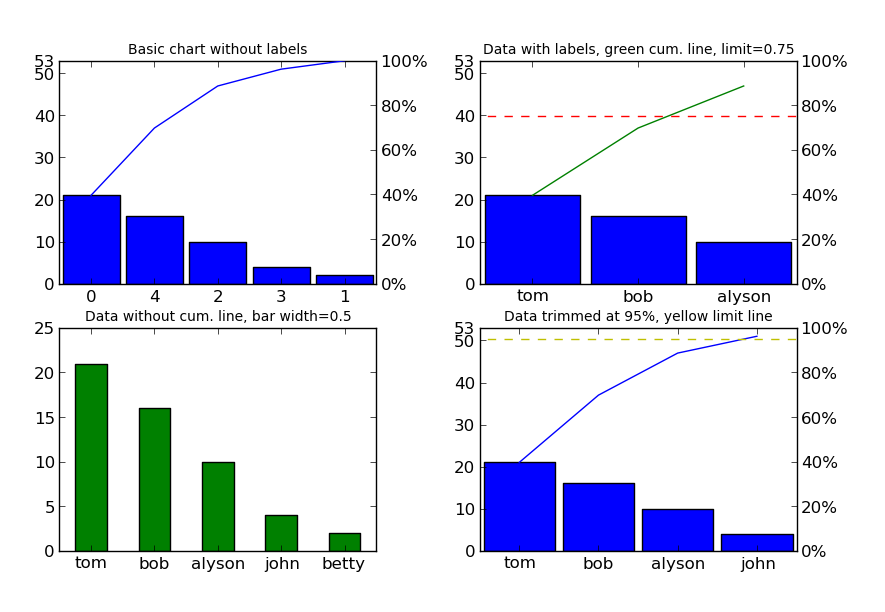

paretochart
===========

`Pareto chart`_ for python (similar to `Matlab`_, but much more flexible).

Features
--------

- **Data labels** for the chart x-axis.
- **Fully customizable** with special non-keyword and keyword inputs:
   - Bar chart: follows the inputs of the `matplotlib.pyplot.bar`_ function.
   - Cumulative line: follows the inputs of the `matplotlib.pyplot.plot`_ function.
   - Limit line: follows the inputs of the `matplotlib.axes.Axes.axhline`_ function.
- Put the chart on **arbitrary axes**.

Basic Examples
--------------
::

     # plot data using the indices as labels
     data = [21, 2, 10, 4, 16]
     
     # define labels
     labels = ['tom', 'betty', 'alyson', 'john', 'bob']
     
     # create a grid of subplots
     fig,axes = plt.subplots(2, 2)
     
     # plot first with just data
     pareto(data, axes=axes[0, 0])
     plt.title('Basic chart without labels', fontsize=10)
     
     # plot data and associate with labels
     pareto(data, labels, axes=axes[0, 1], limit=0.75, line_args=('g',))
     plt.title('Data with labels, green cum. line, limit=0.75', fontsize=10)
     
     # plot data and labels, but remove lineplot
     pareto(data, labels, cumplot=False, axes=axes[1, 0], 
            data_kw={'width': 0.5, 'color': 'g'})
     plt.title('Data without cum. line, green bar width=0.5', fontsize=10)
     
     # plot data cut off at 95%
     pareto(data, labels, limit=0.95, axes=axes[1, 1], limit_kw={'color': 'y'})
     plt.title('Data trimmed at 95%, yellow limit line', fontsize=10)
 
     # format the figure and show
     fig.canvas.set_window_title('Pareto Plot Test Figure')
     plt.show()

Installation
------------

Simply download the ``paretochart.py`` file and put it in a directory that python can find it.

Contact
-------

Please send **feature requests, bug reports, or feedback** to `Abraham Lee`_.

.. _Pareto chart: http://en.wikipedia.org/wiki/Pareto_chart
.. _Matlab: http://www.mathworks.com/help/matlab/ref/pareto.html
.. _matplotlib.pyplot.bar: http://matplotlib.org/api/pyplot_api.html#matplotlib.pyplot.bar
.. _matplotlib.pyplot.plot: http://matplotlib.org/api/pyplot_api.html#matplotlib.pyplot.plot
.. _matplotlib.axes.Axes.axhline: http://matplotlib.org/api/axes_api.html#matplotlib.axes.Axes.axhline
.. _Abraham Lee: mailto:tisimst@gmail.com
